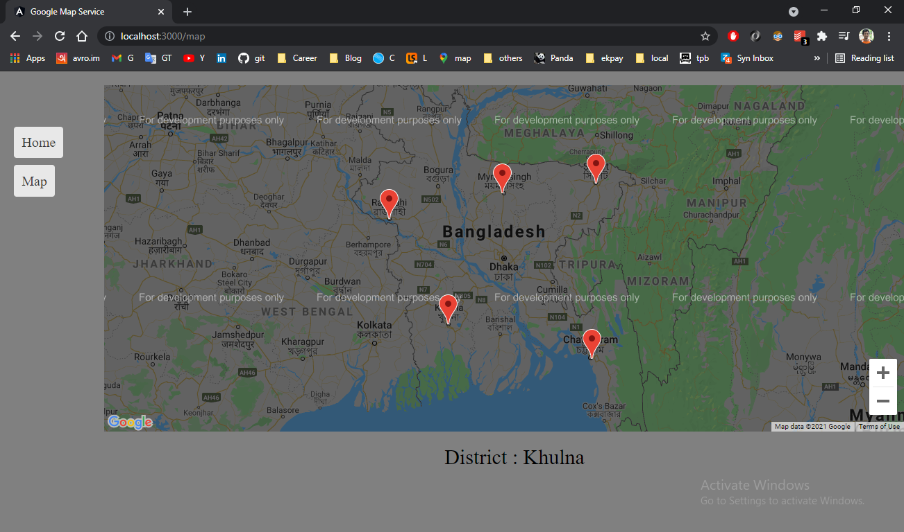

# Technologies used
- Java
- Spring Boot 
- Hibernate
- H2 [In-memory Database]
- Tomcat [Spring Boot Embedded Server]
- Angular 10
- Angular Google Maps (AGM)

# Run the Application

## System configuration prerequisites

### 1. First, make sure you have the Java 8 JDK (or above) and Maven installed.

### 2. Install Node, NPM, Angular and Angular CLI
In my system the versions are
````   
Node : 14.15.1
NPM : 6.14.8
Angular: 10.1.6
Angular CLI: 10.1.7
````

### 3. Clone this ```map-application``` repository
Open terminal and run command
````
git clone https://github.com/hnjaman/map-application.git
````

## Run map-service application
Open terminal and run below command from ``map-application`` directory
````
cd map-service/
mvn clean install
mvn spring-boot:run
````

The application will run in 8082 port insert 5 geolocation (Sylhet, Chittagong, Khulna, Mymensingh, Rajshahi ) into DB 
on application startup.


### API details of map-service application

| API              | REST Method   | API endpoints                                |
|------------------|:--------------|:---------------------------------------------|
|Get maps          |GET            |``http://localhost:8082/api/maps``            |


## Run map-service-ui application
Open terminal and run below command from ``map-service-ui`` directory
````
npm install
ng s --port 3000 --open
````

It will open a new tab in your browser with http://localhost:3000/home url as frontend application, and you will see


### Call get maps API
If you press ``Map`` button in left navigation menu will call **Get maps** API and you will see   


If you click on any of the 5 plotted pin, you will see the corresponding district name of the geolocation.




###### THE END